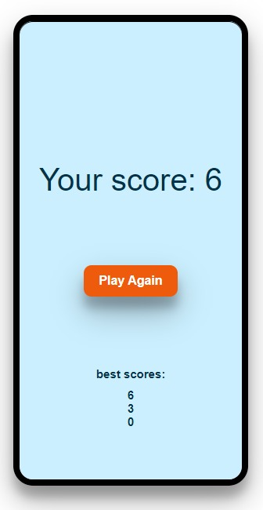
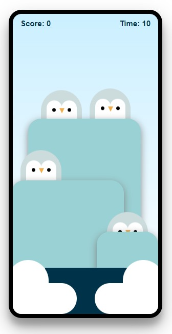

# Catch the Penguin :penguin:
                          |[DEMO](https://lupemorales.github.io/catch-the-penguin/)|
Bienvenidos a CATCH THE PENGUIN, un juego interactivo para niños creado integramente con VanillaJS y CSS puro.

La dinámica es muy sencilla, consiste en atrapar el mayor número posible de pingüinos en un tiempo determinado. Por cada pingüino un punto!

Tus 3 mejores puntaciones quedan registradas en el local storage y se muestran al final de la partida.

Catch the Penguin nace con el proposito de ir creciento a medida que yo también lo voy haciendo como desarrolladora por lo que mi deseo es que siga en continua evolución.

## Objetivo personal

La motivación que me ha llevado a crear  Catch The Penguin es practicar con **animaciones** y **transiciones** en CSS, dibujar en CSS y poner en práctica lo que iba aprendiendo sobre **JavaScript** en el boorcamp de[ Desarrollo Web de Adalab](https://adalab.es/bootcamp-programacion/): asincronía, local storage, manipulación de los elementos del DOM.....

### Algunas vistas del juego

  

## Recursos:
Aquí os dejo algunos recursos en los que me he apoyado:

<a  href="https://hacks.mozilla.org/2014/09/single-div-drawings-with-css/"  target="_blank">

- Single Div Drawings with CSS  

</a>

<a  href="https://www.youtube.com/watch?v=Y0_FMCji3iE"  target="_blank">

- Wenting Zhang - Make CSS your secret super drawing tool

</a>

## Lenguajes y Herramientas

      

## Contacto
Puedes encontrarme en 